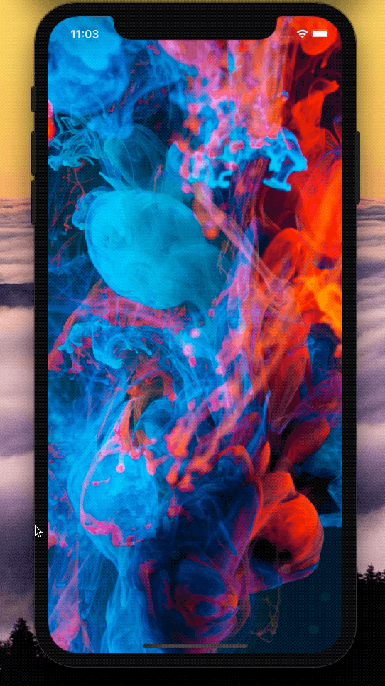

[](https://github.com/WrathChaos/react-native-pure-boilerplate)

[](https://www.npmjs.com/package/@freakycoder/react-native-pure-boilerplate)
[](https://www.npmjs.com/package/@freakycoder/react-native-pure-boilerplate)

[](https://opensource.org/licenses/MIT)
[](https://github.com/prettier/prettier)

<p align="center">
  
</p>

# Installation

You can simply clone the project and start with your barebone project

```sh
git clone git@github.com:WrathChaos/react-native-pure-boilerplate.git my-app-name
```

### Clean-Up & Simple Run

Clean up the files from the example repository and do not forget to install the dependencies

```sh
rm -rf .git README.md
npm i 
react-native run-ios/android
```

# What's Included?

- React Navigation V5
- API Usage Service
- Ready to use Styles
- Built-in Theme System
- Build-in Animated Splash Screen
- Local Storage Utils Functions
- HTTP Network Management (Axios)
- Built-in EventEmitter (EventBus)
- Ready to see Stack and Tab Screens with navigation
- Babel Plugin Module Resolver to fix the relative path problem (visit .babelrc)

# Step By Step Guide

## Rename the project: (Thanks to [react-native-name](https://github.com/junedomingo/react-native-rename))

```sh
npx react-native-rename <your-project-name>
```

> With custom Bundle Identifier (Android only. For iOS, please use Xcode)

```sj
npx react-native-rename <your-project-name> -b <bundleIdentifier>
```

### Install Pods (iOS Only)

- npm i
- cd ios && pod install
- cd .. && react-native run-ios/android

### Android local.properties (Android Only)

- npm i
- cd android && mkdir local.properties
- nano local.properties

#### Example of MacOS Android SDK Path

Make sure that set your right path of Android SDK

```
ndk.dir=/Users/your-name/Library/Android/sdk/ndk-bundle
sdk.dir=/Users/your-name/Library/Android/sdk
```

- cd .. & react-native run-ios/android

# Components

## Styles

- colors
- fonts
- theme
- font-size

## Imports

```jsx
import colors from "@colors";
```

```jsx
import fonts from "@fonts";
```

```jsx
import fontSize from "@font-size";
```

```jsx
import theme from "@theme";
```

if you want to call them all at once

```js
import { theme, fonts, colors, spacing, fontSize } from "@shared-styles/index";
```

### Future Plans

- [x] ~~LICENSE~~
- [ ] MobX State Tree Fork Version
- [ ] Write an article about the lib on Medium

## Credits

<span>Photo by <a href="https://unsplash.com/@aznbokchoy?utm_source=unsplash&amp;utm_medium=referral&amp;utm_content=creditCopyText">Lucas Benjamin</a> on <a href="/?utm_source=unsplash&amp;utm_medium=referral&amp;utm_content=creditCopyText">Unsplash</a></span>

## Author

FreakyCoder, kurayogun@gmail.com

## License

React Native Pure Boilerplate is available under the MIT license. See the LICENSE file for more info.
